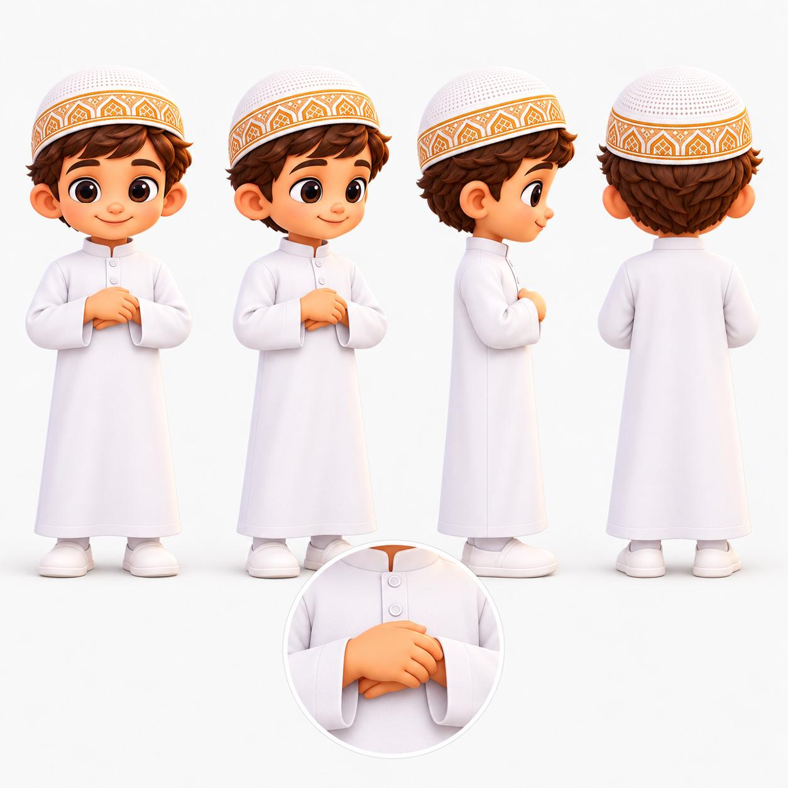
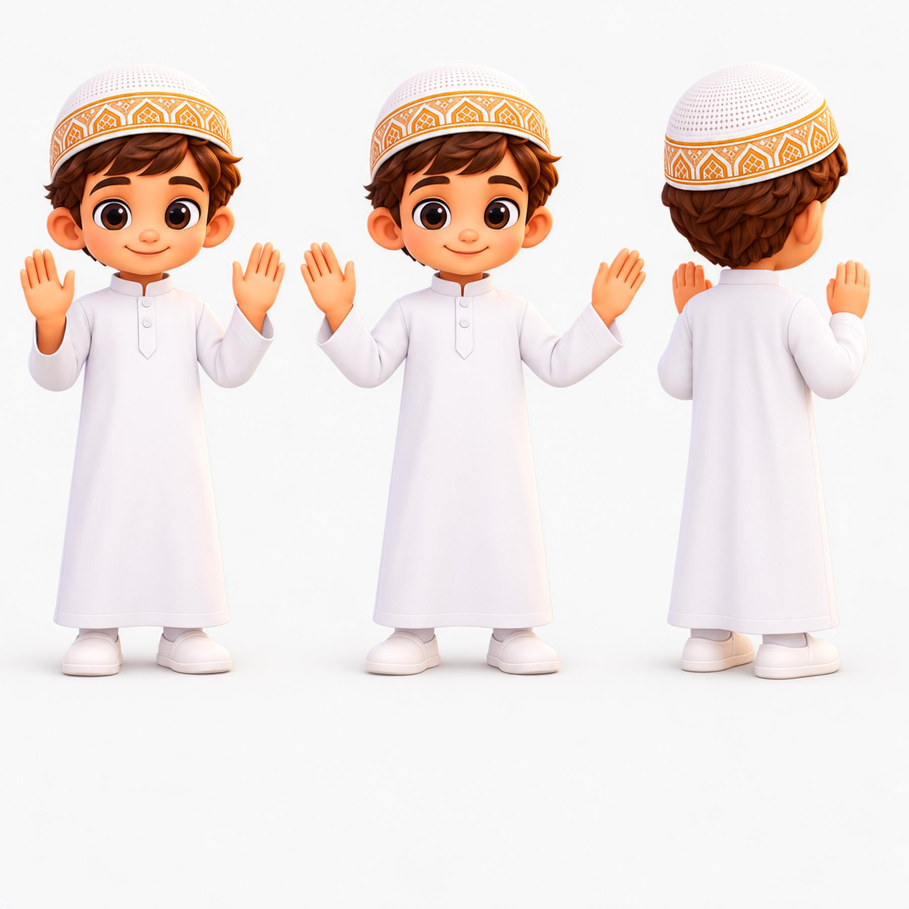
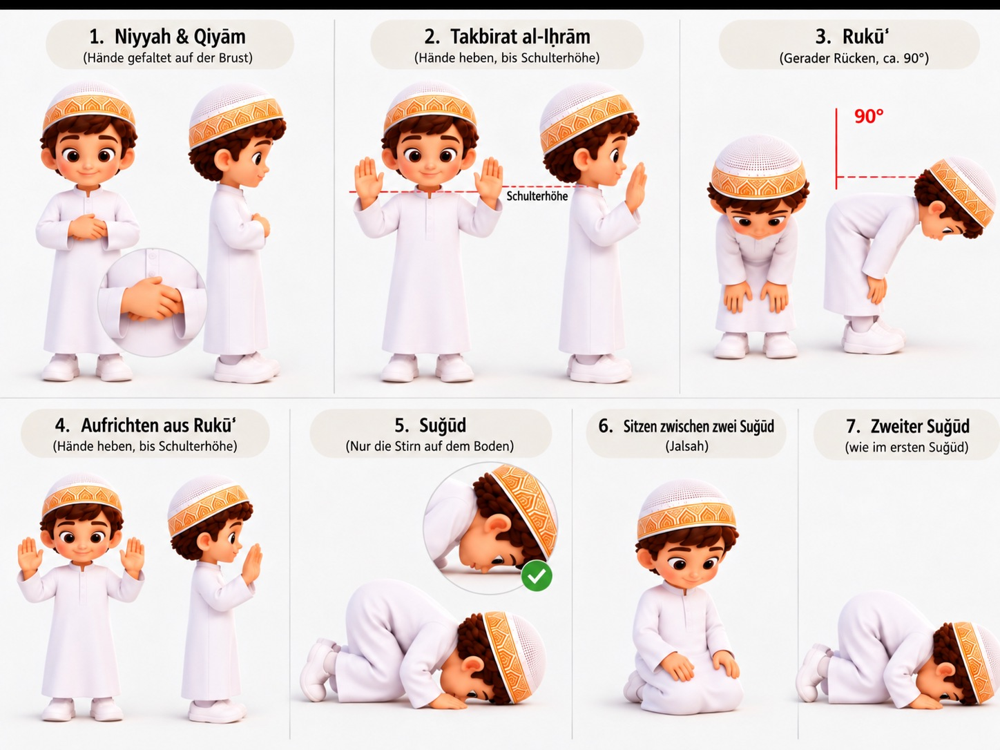

# Bildabnahme: Qiyām → Eröffnungstakbīr → Qabd

**Arbeitsstand:** 08.10.2026 · **Nur interner Review im Draft-PR #825. Kein Kids-Release.**  
**Geltungsbereich:** Jungenfigur zuerst. Bei Mädchenprofil keine unkontrollierte Übernahme der Jungenbilder.

## 1 · Qiyām/Qabd – vom Nutzer als sichtbare Position bestätigt

**Gestaltungsentscheidung bestätigt:** Rechte Hand liegt auf der linken Hand/dem linken Unterarm, beide in Brusthöhe. Am weißen Gewand orientiert sich der Handansatz an der oberen Knopfleiste gemäß ausdrücklicher Bildkorrektur und Bestätigung des Nutzers.

- Die Finger liegen ruhig, Arme entspannt, Kopf aufrecht, Körper gerade.
- Diese Abnahme betrifft **die gezeigte Bildhaltung**. Sie bestätigt weder die Vollständigkeit der hanbalitischen Fiqh-Prüfung noch ein riggtes GLB oder eine Animationsdatei.
- Größeres Originalbild befindet sich im Nutzerkontext sowie in Adobe Creative Cloud; die im Repository gespeicherte Version ist eine kompakte Review-Referenz.

**Status:** `visual_reference_approved` · `3d_animation_locked`.

## 2 · Takbīrat al-Iḥrām – neuer Entwurf, noch zu prüfen

**Soll nach der gewählten Lehre:** Beidseitiges Anheben der offenen Hände bis Schulterhöhe, natürliche Fingerstellung, keine Verdrehung der Handgelenke, aufrechte Kopf-/Rückenachse. Belege: Ṣaḥīḥ al-Buḫārī 736 und Muslim 390.

**Im Entwurf noch nicht bestanden:** Exakte Höhe und Stellung von Handballen/Fingern in der Vorderansicht, vollständige linke und rechte Seitenansichten, konsistenter 360°-Turnaround und reproduzierbarer Gelenkpfad. Der Entwurf zeigt nur Ansichten; **kein 3D**.

**Status:** `candidate_visual_pending_approval` · `3d_animation_locked`.

## 3 · Übergang für den späteren 3D-Rig

1. Ausgangspose: neutral aufrecht, Arme entspannt, vor dem Eröffnungstakbīr.
2. Hände gleichzeitig in einer weichen, symmetrischen Bewegung heben; Ellenbogen leicht gebeugt, offene Hände bis Schulterhöhe. Kein künstliches Überheben.
3. Nach dem Takbīr Arme natürlich senken und die rechte Hand auf der linken **auf Brusthöhe** legen, wie in der bestätigten Qiyām-Referenz.
4. Ende: Hände ruhig in Qabd; kein dauerndes Zittern oder unnatürlich starre Handgelenke.
5. In 3D später frontal, seitlich, schräg und von hinten prüfen. Audio-/Bewegungssynchronität separat.

**Fiqhregel:** Rafʿ al-Yadayn auch vor/nach Rukūʿ; zusätzlich beim Aufstehen nach zwei Rakʿāt nur, wenn eine dritte Rakʿah folgt. **Keine vierte Hebebewegung im 2-Rakʿah-Faǧr.** Weitere Überlieferungsvarianten zur Handhöhe intern dokumentieren, nicht als falsch bezeichnen.

## 4 · Qualitätsschranken

- Ganzkörperfigur muss dieselbe Originalidentität behalten (Gesicht, weiße Kufi/Goldornament, weißer Thawb, Schuhe für Referenz; für reale Indoor-Gebetsszene Fußbekleidung gesondert prüfen).
- Die beiden Bilddateien sind **2D-Referenzen** und keine .glb-Modelle.
- Kleidung bewegt sich ohne Clipping, Hände durchdringen keine Brust/Textur, Gelenke entsprechen Kinderproportionen.
- Vor der ersten GLB-Produktion sind die Aufnahmewinkel und die Schulterhöhen-Geste fachlich/grafisch freizugeben.
- **Keine Modellierung mit künstlich generierten Bewegungen als religiöse Lehrwahrheit ohne separate Abnahme.**
- **Kein Live-Release, keine neuen App-Tabs oder Änderungen an Audio-/Profilmodulen.**

Weitere Nachweise: [Hanbalitische Quellenprüfung](HANBALI-QUELLENPRUEFUNG.md) · [Technisches Storyboard](content/raf-qiyam-storyboard.json).

## 5 · Freigabe der überarbeiteten Sieben-Schritte-Grafik (08.10.2026)

Die letzte, nach mehreren Korrekturen entstandene Bildtafel wurde vom Nutzer mit **„Richtig so“** bestätigt. Sie ist daher die aktuelle **visuelle Referenz**:

**Verbindliche Prüfvorgaben für die zukünftige 3D-Umsetzung:**

- **Originalproportionen beibehalten.** Keine Verlängerung der Beine, weder in der Seitenansicht des Rukūʿ noch in anderen Positionen. Dieselbe ursprüngliche Jungenfigur, Körper-/Kopfgröße und Kleidung.
- **Rukūʿ:** Beugung an der Hüfte; Rücken vom Becken bis Schulterbereich **gerade und annähernd waagerecht wie eine Tischplatte**; Hände korrekt an den Knien. Nicht die anatomisch missverständliche Zahl „180°“ als Hüftwinkel verwenden: Der entscheidende Qualitätsmaßstab ist die sichtbare, gerade Rückenlinie.
- **Suǧūd (erste und zweite Niederwerfung):** Stirn sicher auf der Unterlage, Nase leicht mit Kontakt, **Lippen/Mund/Kinn ohne Bodenkontakt**. Ein Küssen des Bodens durch den Mund ist in dieser Lernvisualisierung ausdrücklich falsch. Gelenkwinkel und Haltung an die Kinderproportionen anpassen.
- **Takbīrat al-Iḥrām und Rafʿ al-Yadayn:** beide Hände **bis Schulterhöhe**, nicht in Richtung der Ohren überheben.
- **Qiyām:** bisher gesondert bestätigte Handhaltung auf der Brust bleibt unverändert.
- **Sujūd-Hadithprüfung:** Die Sieben-Kontaktpunkte-Lehre berücksichtigt **Stirn und Nase** gemeinsam im Kopfbereich (Buḫārī 812); nicht behaupten, ausschließlich die Stirn sei islamrechtlich die einzige relevante Kontaktfläche. Die gestalterische Vorgabe meint ausdrücklich „Stirn und Nase, nicht der Mund“.

**Freigabegrenze:** Nur das vom Nutzer bestätigte **2D-Bild**. Noch kein riggtes 3D-Modell, kein Bewegungsclip, keine Audio-/Fachfreigabe und keine Live-Veröffentlichung. Vor Produktion die Kontaktpunkte, Kinderproportionen und Handbewegungen an einem echten 360°-Rig kontrollieren.
